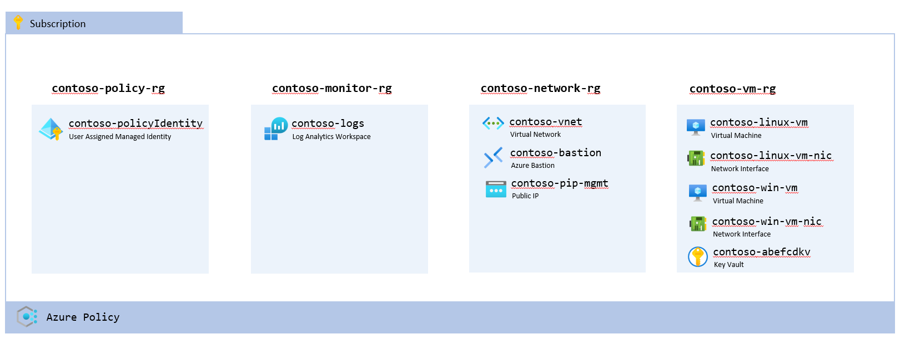

# Azure-VM-workshop

## Overview


## Prerequisites

1. An Azure subscription with the [Owner](https://learn.microsoft.com/en-us/azure/role-based-access-control/built-in-roles#owner) role

The instructions in the lab uses [Azure CLI](https://learn.microsoft.com/en-us/cli/azure/) to interact with Azure (for example deploying [Bicep](https://learn.microsoft.com/en-us/azure/azure-resource-manager/bicep/overview?tabs=bicep) templates). All commands can be run from [Azure Cloud Shell](https://learn.microsoft.com/en-us/azure/cloud-shell/overview), meaning there is no need to install any software except a web browser locally.

## Configure Azure Cloud Shell

[Azure Cloud Shell](https://learn.microsoft.com/en-us/azure/cloud-shell/overview) is an interactive, authenticated, browser-accessible shell for managing Azure resources. All the lab instructions in this document can be run from the cloud shell , directly in your browser. There is no need to install anything locally on your computer.

### To access the cloud shell please follow those step:

1. Navigate to https://portal.azure.com
2. Log in
3. Launch cloud shell from the top bar menu in the portal

   
4. If it is the first time you launch cloud shell you will need to configure it with a default runtime and [a storage account](https://learn.microsoft.com/en-us/azure/cloud-shell/persisting-shell-storage)
   - Select `Powershell` or `Bash` as your default runtime. The instructions in this document work with both.
   - Provision the storage account in your lab subscription with the default settings

Once cloud shell is loaded you can select your runtime (either `Powershell` or `Bash`) from the drop down list at the top.

### Make sure that the correct subscription is selected 

Check the current subscription with the following command:

```bash
az account show --query name
```

If you need to change subscription, please run the following command

```bash
az account set --subscription "NameOfMySubscription"
```

## Clone the repository content

The content of this repository can be cloned with the following command.

```bash
git clone https://github.com/latj/Azure-VM-workshop.git
```

You can then change into the repository folder with the `cd` command

```bash
cd Azure-VM-workshop
```

## View and edit files

To view and edit the files you can use your favorite editor. If you are running Azure Cloud Shell it comes with an integrated file editor built called [Azure Cloud Shell Editor](https://learn.microsoft.com/en-us/azure/cloud-shell/using-cloud-shell-editor)

### Opening the editor

- For simple file creation and editing, launch the editor by running `code .` in the Cloud Shell terminal. This action opens the editor with your active working directory set in the terminal.
- To directly open a file for quick editing, run `code <filename>` to open the editor without the file explorer.
- Select the `{}` icon from the toolbar to open the editor and default the file explorer to the `/home/<user>` directory.

### Closing the editor

- To close the editor, open the `...` action panel in the top right of the editor and select Close editor.

### A useful few shortcuts

- Save: `CTRL`+ `S`
- Close: `CTRL` + `Q`
- Open file (while inside the editor): `CTRL` + `P`

## Challenge 1: Deploy supporting Infrastructure

This goal of the first challenge is to deploy supporting infrastructure for virtual machines, such as networks and monitoring resources.

### 1.1 Deploy Monitoring Capabilities

To collect telemetry data from virtual machines a [Log analytics workspace](https://learn.microsoft.com/en-us/azure/azure-monitor/logs/log-analytics-workspace-overview) and [data collection rules](https://learn.microsoft.com/en-us/azure/azure-monitor/essentials/data-collection-rule-overview) are needed. In this lab series we will deploy a central log analytics workspace which multiple virtual machines can use to send their logs to.

The folder [monitoring/](monitoring/) contains a set of bicep templates that deploys a log analytics workspace along with a few example data collection rules. They can be deployed using the following command:

```bash
az deployment sub create --location "SwedenCentral" --name "monitor" --template-file monitor/main.bicep --parameters @monitor/main.parameters.json
```

### 1.2 Deploy Network

Before any virtual machines can be deployed there needs to be a network to deploy them into. The folder [network/](network/) contains a set of bicep templates that deploy a simple network and an [Azure Bastion](https://learn.microsoft.com/en-us/azure/bastion/bastion-overview) host that can be used to access the machines.

The network can be deployed using the following command

```bash
az deployment sub create --location "SwedenCentral" --name "network" --template-file network/main.bicep --parameters @network/main.parameters.json
```

## Challenge 2: Deploy VMs with different settings using Bicep

The folder [vm/](vm/) contains templates to deploy and configure [virtual machines](https://learn.microsoft.com/en-us/azure/virtual-machines/overview).

### 2.1 Deploy plain virtual machines

The first step is to deploy a plain virtual machine. To create a virtual machine with an [OS disk](https://learn.microsoft.com/en-us/azure/virtual-machines/managed-disks-overview) and a [network interface card](https://learn.microsoft.com/en-us/azure/virtual-network/virtual-network-network-interface?tabs=network-interface-portal) connected to the previously created network please use the below command

```bash
az deployment sub create --location "SwedenCentral" --name "vm" --template-file vm/main.bicep --parameters @vm/main.parameters.json 
```

The template deploys both a windows virtual machine (defined in `windows.bicep`) and a Linux virtual machine (defined in `linux.bicep`). The machines can be viewed through the Azure Portal.

### 2.2 Change the size of the VMs

The virtual machines are using a general purpose compute VM SKU from the [Dasv5-series](https://learn.microsoft.com/en-us/azure/virtual-machines/dasv5-dadsv5-series#dasv5-series).
The exact size used is `Standard_D2as_v5`, which has 2 vCPU and 8 GiB RAM.

To update the vm size, open upp the file `linux.bicep` or `windows.bicep` and edit the variable `vmSize`. Set it for example to `Standard_D4as_v5`, which doubles the size to 4 vCPU and 16 GiB RAM

```bicep
var vmSize = 'Standard_D4as_v5'
```

```bash
az deployment sub create --location "SwedenCentral" --name "vmWithLargerSize" --template-file vm/main.bicep --parameters @vm/main.parameters.json 
```

### 2.3 Expose the size of the VM's as a parameter

It is sometimes beneficial to expose certain values from the templates as parameters. By doing that input values can be customized when calling the template, removing the need for editing files to change the value (for example the VM size). To expose the VM size as a parameter please do the following

1. Replace variable `vmSize` with a parameter in `vm/linux.bicep` and/or `vm/windows.bicep`

   ```bicep
      var vmSize = 'Standard_D4as_v5'          // <- Remove This Line

      @description('Sets the size of the VM')  // <- Add this line
      param vmSize string                      // <- Add this line
   ```

2. The file `vm/main.bicep` is the one calling the other bicep modules inside the `vm` folder. This is the file that we are calling from the Azure CLI.

   ```bicep
      @description('Sets the size of the VM')  // <- Add this line
      param vmSize string = 'Standard_D4as_v5' // <- Add this line
   ```

3. The file `vm/main.bicep` also need to pass the vm size to the `vm/linux.bicep` and/or `vm/windows.bicep` modules. Edit the params section of `linuxVmDeploy` and `windowsVmDeploy` to pass the VmSizeParameter

   ```bicep
      ...
      params: {
         ...
         vmSize: vmSize
         ...
      }
      ...
   ```

To redeploy the VM's with the default size, run the following command

```bash
az deployment sub create --location "SwedenCentral" --name "vmWithLargerSize" --template-file vm/main.bicep --parameters @vm/main.parameters.json 
```

Now it is also possible to pass a virtual machine size to the CLI, try with a few different sizes and observe the result in the Azure portal

```bash
az deployment sub create --location "SwedenCentral" --name "vm" --template-file vm/main.bicep --parameters @vm/main.parameters.json vmSize='Standard_D2as_v5'
```

### 2.4 Rename the VMs

All resources deployed to Azure has a name. The virtual machines in this examples are called `contoso-linux-vm` and `contoso-windows-vm`. 

If the name parameter is changed in the bicep template and then it is deployed, Azure will interpret that as a new resource that has not previously been deployed. It is not possible to *change* the name of an existing resource in Azure, instead it needs to be removed and a new resource with the new name can be deployed.

To demonstrate this, edit the name of the virtual machines by changing the value of the variable `vmName` in either `vm/linux.bicep` or `vm/windows.bicep`

Redeploy the VMs by the following command:

```bash
az deployment sub create --location "SwedenCentral" --name "vm" --template-file vm/main.bicep --parameters @vm/main.parameters.json
```

You will see in the portal that the virtual machines with the old names are still there, and that new ones with the new names have been created.

**Change the names back to their original values** and also feel free to clean up the additional machines in the resource group as they will not be needed (always good to free up some resources)

### 2.5 Enable VM Insights and Deploy a data collection rule

[VM insights](https://learn.microsoft.com/en-us/azure/azure-monitor/vm/vminsights-overview) monitors the performance and health of virtual machines. It can be accessed in the portal by navigating to the Virtual Machine and then selecting "Insights" from the "Monitoring" Section in the left pane.

Currently VM Insights is not configured and thus no data will be shown.

To enable VM Insights a few actions must be taken:

- Enable the [Azure Monitor Agent](https://learn.microsoft.com/en-us/azure/azure-monitor/agents/agents-overview)
- Define a [data collection rule](https://learn.microsoft.com/en-us/azure/azure-monitor/essentials/data-collection-rule-overview)
- Associate the Data collection rule with the Virtual machine

The below command will enable the [vm/vmInsights.bicep](vm/vmInsights.bicep) module in the deployment:

```bash
az deployment sub create --location "SwedenCentral" --name "vmWithDcr" --template-file vm/main.bicep --parameters @vm/main.parameters.json --parameters enableVmInsights='true'
```

Once the new virtual machines have been created, navigate to it in the Azure portal and select "Insights" from the "Monitoring" Section in the left pane. It should now contain data.

### 2.6 Enable Disk Encryption on the VMs

[Azure Disk Encryption for Windows Virtual Machines](https://learn.microsoft.com/en-us/azure/virtual-machines/extensions/azure-disk-enc-windows) uses BitLocker to provide full disk encryption on Azure virtual machines running Windows. [Azure Disk Encryption for Linux virtual machines](https://learn.microsoft.com/en-us/azure/virtual-machines/linux/disk-encryption-overview) uses the DM-Crypt feature of Linux to provide full disk encryption of the OS disk and data disks. Both solutions are integrated with [Azure Key Vault](https://learn.microsoft.com/en-us/azure/key-vault/general/overview) to manage disk encryption keys and secrets.

By passing the parameter `-diskEncryption $true` to the deployment of the `main.bicep` file the content of `diskEncryption.bicep` is deployed in addition to what is inside the `linux.bicep` and `windows.bicep` file. This will create a key in a key vault which will be used to encrypt the disks on the VM using  Azure Disk Encryption

```bash
az deployment sub create --location "SwedenCentral" --name "vmWithDiskEncryption" --template-file vm/main.bicep --parameters @vm/main.parameters.json --parameters enableDiskEncryption='true'
```
### 2.7 Generate name for your machine
There is several ways on how you can generate a name and how it will work with your organizations name standard. In this exercise, a Azure Function is used to generate a name for either Windows or Linux machines and store them to a table storage.

After you generated a name, try to figure out how to modify the vm templates and deploy a vm with your generated name.
#### Generate names through Powershell

First you will to run the script Get-Names.ps1 , try tabbing forward the values for each parameter

```powershell
pwsh -C ".\Scripts\Get-Name.ps1 -OS windows -GenerateOrList Generate"

```

To list names and there properties, try the following

```powershell
pwsh -C " .\Scripts\Get-Name.ps1 -OS windows -GenerateOrList List"
```

#### Generate names through Bash

To generate a new name please use the following command

```bash
bash Scripts/getnames.sh --linux --generate
```

To list names and there properties, try the following

```bash
bash Scripts/getnames.sh --linux 
```

## Challenge 3: Manage virtual machines at scale using Azure Policy

In step 2.5 the data collection rule was created and attached to the VMs by modifying the bicep template. While this works and is a valid approach it can become error prone to require everyone that deploys virtual machines to configure data collection rules correctly. Instead the rules can be applied automatically by [Azure policy](https://learn.microsoft.com/en-us/azure/governance/policy/overview) to ensure that the same set of basic telemetry data is collected from all VM's deployed in a subscription.

There is a rich set of [built in policy definitions](https://learn.microsoft.com/en-us/azure/governance/policy/samples/built-in-policies) in Azure that can be used out of the box. There is also the possibility to define custom policies tailored to specific needs.

### 3.1 Enable VM Insights using custom Azure policies (deployIfNotExists)

A policy with a [deployIfNotExists effect](https://learn.microsoft.com/en-us/azure/governance/policy/concepts/effects#deployifnotexists) is a policy that can run an additional deployment after the resource manager have created or updated a resource.

In this example we will be using a set of custom policies defined in `policies/customPolicies.bicep`. The policies deploys the Azure monitoring agent extension as well as configures a data collection rule. To enable the policy on the subscription run the following command

```bash
az deployment sub create --location "SwedenCentral" --name "policyWithDataCollectionRule" --template-file policies/main.bicep --parameters @policies/main.parameters.json enableDataCollectionPolicy='true'
```

As we previously deployed and configured  virtual machines with VM Insights enabled, let's remove those virtual machines and redeploy without VM Insights. This should trigger the policy to add VM-Insights

To remove the resource group containing the Virtual Machine, please run

```bash
az group delete --name contoso-vm-rg
```

to redeploy the machine, please run

```bash
az deployment sub create --location "SwedenCentral" --name "vmWithDiskEncryption" --template-file vm/main.bicep --parameters @vm/main.parameters.json enableDiskEncryption='true'
```

Once the new virtual machine has been created, navigate to it in the Azure portal and select "Insights" from the "Monitoring" Section in the left pane. It will say that Insights is not yet configured. In a few minutes when the policy has executed it should be automatically configured and display data

### 3.2 Add a policy that blocks deployments of public IP-addresses (Deny)

A policy with a [deny effect](https://learn.microsoft.com/en-us/azure/governance/policy/concepts/effects#deny) is a policy that disallows certain actions or resources by blocking them. A common example is to deny assignment of public IP addresses directly to virtual machines. By assigning the policy called `Network interfaces should not have public IPs` to the subscription (or the resource group containing the virtual machines) it will not be possible to assign a public IP to the NIC on the virtual machine.

#### Option 1: Assign the policy from the Azure portal

1. Navigate to "Policy" by using the search field in the top navigation bar
2. Select "Definitions" from the left hand side panel
3. Filter the list by name (Enter `Network interfaces should not have public IPs` in the search field)
4. Click on the policy definition
5. Click "Assign"
6. Select the Virtual machine resource group as scope
7. Click "Review + Create"

#### Option 2: Assign the policy using bicep

The policy could of course be deployed using a bicep template as well.

The below command deploys the policy assignment:

```bash
az deployment sub create --location "SwedenCentral" --name "policyWithDenyPublicIp" --template-file policies/main.bicep --parameters @policies/main.parameters.json enableDenyPublicIp='true'
```

#### Try to create a public ip and assign it to a VM

A new public IP can be created in the vm resource group using the below command

```bash
az network public-ip create --name "test-pip" --resource-group "contoso-vm-rg"
```

To assign the public IP to the NIC of the Linux VM, use the below command:

```bash
az network nic ip-config update --name "ipconfig1" --nic-name "contoso-linux-vm-nic" --resource-group "contoso-vm-rg" --public-ip-address "test-pip"
```

Since there is a policy that does not allow NICs to be associated with public IPs, you should get an error of type `RequestDisallowedByPolicy`

To clean up, remove the public IP using the following command

```bash
az network public-ip delete --name "test-pip" --resource-group "contoso-vm-rg"
```

### 3.3 Add a policy that automatically append tags to deployed resources (Append)

A policy with an [append effect](https://learn.microsoft.com/en-us/azure/governance/policy/concepts/effects#append) can add new fields to a resource before the deployment occurs.

A common use case is to automatically append a tag to all resources. This can be used to automatically add an `environment` or `cost-center` tag for all resources deployed in a subscription. There is a built in policy called [Append a tag and its value to resources](https://portal.azure.com/#view/Microsoft_Azure_Policy/PolicyDetailBlade/definitionId/%2Fproviders%2FMicrosoft.Authorization%2FpolicyDefinitions%2F2a0e14a6-b0a6-4fab-991a-187a4f81c498)

Add the below bicep snippet to `policies/policyAssignments` to configure deployment of the policy on the current subscription. Please feel free to edit the `TAGNAME` and `TAGVALUE`.

```bicep
resource tagAppendAssignment 'Microsoft.Authorization/policyAssignments@2022-06-01' = {
  name: '${baseName}-configure-tagAppend'
  location: location
  identity: {
    type: 'UserAssigned'
    userAssignedIdentities: {
      '${policyIdentityId}': {}
    }
  }
  properties: {
    policyDefinitionId: tenantResourceId('Microsoft.Authorization/policyDefinitions', '2a0e14a6-b0a6-4fab-991a-187a4f81c498')
    parameters: {
      tagName: {
        value: 'TAGNAME'
      }
      tagValue: {
        value: 'TAGVALUE'
      }
    }
  }
}
```

To deploy the policy, run the following command:

```bash
az deployment sub create --location "SwedenCentral" --name "policy" --template-file policies/main.bicep --parameters @policies/main.parameters.json
```

The policy will apply to all resources created in the future, as well as all future updates to resource. However existing resources are unaffected (until they are updated). To see the policy in action perform an update on one of the existing virtual machines, for example through

- Changing the vm size as described in section 2.3-2.4
- Edit the tags through the portal

After you have done any change or update to the VM you will see that it has the new tag assigned

### 3.4 Enable Microsoft Defender for cloud through built in policy (deployIfNotExists)

### 3.5 Enable Azure backup using a built in Azure policy

Also [Azure backup](https://learn.microsoft.com/en-us/azure/backup/backup-overview) can be enabled using Azure policy

To enable the built in policy for backups on the subscription run the following command:

```bash
az deployment sub create --location "SwedenCentral" --name "policyWithBackup" --template-file policies/main.bicep --parameters @policies/main.parameters.json enableBackupPolicy='true'
```

The backup policy is configured to target all virtual machines with the tag `backup` set to `yes`. The tag value can be set to yes either through the portal or by re-running the deployment of the VM with the tag `enableBackupTag` set to true:

```bash
az deployment sub create --location "SwedenCentral" --name "vmWithBackupTag" --template-file vm/main.bicep --parameters @vm/main.parameters.json enableBackupTag='true'
```

Once the policy runs it will create a new [Service Recovery Vault](https://learn.microsoft.com/en-us/azure/backup/backup-azure-recovery-services-vault-overview) in the same resource group as the virtual machine and configure a daily backup of the machine to the vault

## Challenge 4: Configure the OS on deploy

### 4.1 Linux: Cloud Init

[cloud-init](https://learn.microsoft.com/en-us/azure/virtual-machines/linux/using-cloud-init) is a widely used approach to customize a Linux VM as it boots for the first time. You can use cloud-init to install packages and write files, or to configure users and security. Because cloud-init is called during the initial boot process, there are no additional steps or required agents to apply your configuration.

cloud-init can be used for basically any configuration task, for example installing packages or writing configuration files.

cloud-init has multiple input types and it will use the first line of the input to determine the type. Two common input types are:

- `#cloud-config`: The cloud-init config type works across distributions, for example rather than installing packages directly the packages are listed and cloud-init uses the native package manager to install them
- `#!/bin/bash`: A bash script can be used as input to cloud-init. While a bash script (probably) won't work across distributions it is a simple way to execute an already existing setup script using cloud-init

The script [vm/setup.sh](vm/setup.sh) writes a line to the file `/tmp/cloudInit.txt` when it executes. To feed the script into cloud-init use the commands below:

**Since cloud-init only runs on the first boot, we must first delete the VM's we deployed earlier**

```bash
az group delete --name contoso-vm-rg
```

**Deploy the virtual machines feeding the vm/setup.sh into cloud-init**

```bash
az deployment sub create --location "SwedenCentral" --name "vmWithInit" --template-file vm/main.bicep --parameters @vm/main.parameters.json customData=@vm/setup.sh
```

Connect to the VM through bastion and verify the contents of `/tmp/cloudInit.txt` (which should have been created by cloud init on the first boot)

### 4.2 Windows: CustomScriptExtension
To run script on Windows machine, CustomScript can be used. This simple example will create simple textfile in c:\temp
To update the vm size, open upp the file `main.bicep` and edit the parameter `runcustomscript` to true.

```bicep
param runcustomscript bool = false
```

```bash
az deployment sub create --location "SwedenCentral" --name "vmWithLargerSize" --template-file vm/main.bicep --parameters @vm/main.parameters.json 
```
### 4.3 Machine configuration: Enable AzureSecurityBaseline on the VMs
[Machine configuration feature of Azure Automanage](https://learn.microsoft.com/en-us/azure/governance/machine-configuration/overview) also named "Guest Configuration" provides native capability to audit or configure operating system settings as code, both Azure VMs and Arc-enabled machines. Machine configuration as different assinment types, they are Audit, ApplyAndMonitor and ApplyAndAutoCorrect, in the sample below ApplyAndMonitor is used, more info [Remediation options for machine configuration](https://learn.microsoft.com/en-us/azure/governance/machine-configuration/machine-configuration-policy-effects)

By passing the parameter `-securityBaseline $true` to the deployment of the `main.bicep` this feature is deployed in addition to what is inside the `linux.bicep` and `windows.bicep` file. This will create a Guest Assignment resource and assosiate the VM to it

```bash
az deployment sub create --location "SwedenCentral" --name "vmWithSecurityBaseline" --template-file vm/main.bicep --parameters @vm/main.parameters.json --parameters securityBaseline='true'
```
### 4.4 Machine configuration: Enable AzureSecurityBaseline at scale
Machine configuration, supports both Aduit and DeployIfNotExist with Azure Policy. But only Audit is supported for AzureSecurityBaseline. The recommeded way to do this is to use [Azure Automange Best Practies](https://learn.microsoft.com/en-us/azure/automanage/overview-about) custom profiles, to configure AzureSecurityBaseline on the VMs. Then we can assign the VMs to that custom profile through Azure policy.

Create the Automange Best Preatices custom profile,  
## Clean Up

1. Remove all resource groups created
   - Remove Backup Vault
2. Remove policy assignments from subscription
3. Remove Custom policy definitions on the subscription
4. Remove orphaned role assignments on the subscription